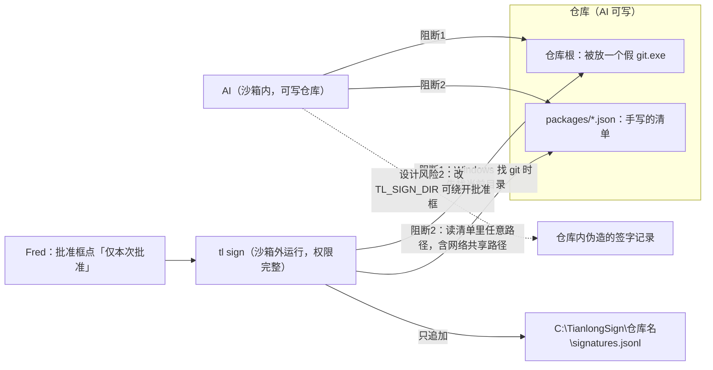

Note: local `main` is stale (954ed4a); the real base is `origin/main` (2d28f50). The branch changes only 3 files. Let me read everything.

Now the spec (the authoritative source).

Now empirical probes in an isolated scratch project (nothing in the repo is touched).

Still probing (concurrency now); report follows shortly.

# 段1 实现审查报告（审查员，只读）

**审查对象**：`origin/dev/seg1-tl`，提交 `7550bc3`（"实现段1记录层命令行工具"）

**先说明对比基准**：本地的 `main` 已经过时，停在 954ed4a。如果直接按指令运行 `git diff main...origin/dev/seg1-tl`，会列出 20 个文件，其中包括 tests/ 和 docs/spec/，但那些改动其实已经在远端 main 上。按真实基准 `origin/main`（2d28f50，也是两条分支的分叉点）对比，本分支只改了 3 个文件：

| 文件 | 改动 |
| :-- | :-- |
| `src/bin/tl.py` | 新增，448 行 |
| `docs/bootstrap/04_交接卡_段1实现.md` | 新增 |
| `src/bin/.gitkeep` | 删除 |

整个审查过程没有改动、提交或推送仓库里的任何文件。所有实测都在一个临时目录里完成：先把该分支导出过去，再建一个测试项目。

---

## 一、结论：有条件通过

代码本身写得扎实。规格规定的行为基本逐条对上了，166 个锁定验收用例全部通过。

但"签字安全"这一项里有 **2 条阻断问题**，属于实现层面的缺陷，必须在本机第一次使用真实签字目录（`C:\TianlongSign`）之前改掉。另有 **3 条设计级风险**不能算开发员的错，但会直接削弱门1 的两条验收："签后改件即作废"和"伪造签字判无效"。这 3 条需要架构师裁定。

下图标出了问题在签字流程中的位置：

---

## 二、阻断问题（本机首次运行前必须修改）

### 阻断1：Windows 上会先在仓库根里找 git，AI 放的程序会在沙箱外运行

| 项 | 内容 |
| :-- | :-- |
| 位置 | `src/bin/tl.py:48`，`subprocess.run(["git", "rev-parse", ...])` |
| 问题 | 这里只写了程序名 `git`，没有写完整路径。Windows 按微软 CreateProcess 文档的查找顺序，**先找当前目录，再找 PATH**。AI 在沙箱里可以往仓库根写一个 `git.exe`。Fred 批准 `tl sign` 以后，这条命令在沙箱外运行，假 git 也就带着 Fred 的完整权限执行了：可以随意改签字目录、改 `.codex` 配置（对应人工用例 M2、M3）。批准框里显示的命令完全正常，Fred 看不出来。 |
| 同类输入 | 下面这些也能改变"仓库根"，从而改变写入位置： • 当前目录 • 环境变量 `GIT_DIR`、`GIT_WORK_TREE` • `.git/config` 里的 `core.worktree`（AI 可写） 签字文件的路径由"仓库根文件夹名"决定，所以改了仓库根，就能把签字写进另一个仓库的签字记录。 |
| 建议改法 | ① 从 PATH 里自己找 git 的绝对路径：跳过空项和相对路径，跳过落在仓库或当前目录下的目录。 ② 调用 git 时去掉所有 `GIT_` 开头的环境变量。 ③ sign 额外核对：当前目录就是仓库根，或者在仓库根之内。 |
| 验证状态 | 本机是 Linux，Linux 不在当前目录找程序，所以**没有实测**。建议人工实测③时顺带验证一次，方法无害：把 `C:\Windows\System32\whoami.exe` 复制成仓库根下的 `git.exe`，然后运行 `python -c "import subprocess;subprocess.run(['git','--version'])"`。如果输出的是 whoami 的内容，就证明问题存在。 |

### 阻断2：sign 和 verify 不核对清单内容，签了不该签的东西

| 项 | 内容 |
| :-- | :-- |
| 位置 | `tl.py:121-133`（第 128 行 `(root / entry["path"]).resolve()`），以及 `113-118`、`217-223`、`249-257` |
| 问题 | 仓库边界只在 pack 里检查过。AI 可以跳过 pack，自己手写一份清单（指纹算法是公开的）。sign 和 verify 只核对清单"自己算自己对不对"，不核对规格 4.2 的约束。实测结果（第 1 行是本机实测，第 2 行按代码推断、未实测）： |

| 手写清单的内容 | sign 结果 | verify 结果 | 违反的规格 |
| :-- | :-- | :-- | :-- |
| `files[].path = "../../outside/s.txt"`（仓库外） | **0，写入签字** | **0** | 4.2：不得指向仓库外 |
| Windows 上路径写成 `\\某主机\共享\x`（未实测） | 在沙箱外去连这台主机 | 同左 | 相当于有网络访问，还可能泄露 Windows 登录凭据的散列值 |
| 把已签的 g1-01 清单原样复制成 `g1-02.json` | **0**（同一份内容换个编号又签了一次） | **0** | 4.2：文件名须与 `package_id` 一致（只有 check 能查出来，返回 2） |

**建议改法**：写一个公用的清单结构校验，sign 和 verify 在接触任何受审文件之前都先调用它。校验内容：

- 清单里的 `package_id`、文件名、命令行参数三者一致，`task_id` 一致；
- `files` 不为空，恰好一个"正文"；
- 每个 path 都是相对路径：不含盘符、不以 `\\` 开头、不含 `..`，解析后仍在仓库根之内，并且不在任何任务的 `packages/` 目录里。

不合格时的退出码，建议按规格第 2 节"读入的记录本身有误"返回 **2**。这个码在 `verify --task` 严重程度排序里的位置，请架构师补一句裁定。

---

## 三、非阻断问题（可以以后改）

| # | 位置 | 问题 | 建议 |
| :-: | :-- | :-- | :-- |
| 1 | 第 168～234 行多处 `return 1/3/5` | 出错时**什么都不输出**。比如 `C:\TianlongSign` 还没建，sign 直接返回 1，Fred 看不出原因。加了 `--json` 时标准输出为空，也不是合法 JSON。 | 向标准错误输出一行中文原因；`--json` 时输出 `{"ok":false,...}`。**建议首次实测前顺手改掉**，否则人工用例 M1 出问题时难以排查。 |
| 2 | 207-209 | pack 用覆盖方式写清单。实测同时运行 6 个 pack，只留下 4 个文件：as-01 和 as-03 各被覆盖一次，两次都返回 0。结果是推送给 Fred 的指纹码与磁盘上的清单对不上。 | 用独占创建方式打开（模式 `"x"`），编号冲突时取下一个号。 |
| 3 | 364 | `status --task` 不核对任务编号。实测 `--task /etc` 会去读 `/etc/progress.json`。Windows 上传网络共享路径（`\\主机\共享`）会触发网络访问。非法编号返回 2，而规格第 2 节规定用法错误是 1。 | 与 check、verify 一致：编号先过格式检查，不合法返回 1。 |
| 4 | 136-138 | `TL_SIGN_DIR` 设为空串时，程序把它当成当前目录。实测签字被写进了**仓库内**的 `./proj/signatures.jsonl`，不需要任何批准。设成相对路径也一样。 | 空串按"未设置"处理；必须是绝对路径；解析后不能落在仓库根之内。已核对：这样改不影响现有测试，测试的签字目录与测试仓库是并列目录。 |
| 5 | 239-241 | 追加签字时不加锁、不强制落盘。Windows 的追加写入不是原子操作，多个进程同时签字时，理论上链条会分叉，之后永远返回 5。在 Linux 上 5 轮×12 个并发签字**没有复现**。另外，进程中途崩溃会留下半行，实测之后所有 sign、verify 都返回 5，而且没有修复手段。 | 用一个锁文件（加锁后重新读链条再写入）；写完调用 `flush` 和 `os.fsync`。损坏后怎么修复，请架构师出一份处理规程。 |
| 6 | 318 | 假设日志里 `low_reason` 写成数组时程序崩溃，实测报 `TypeError: unhashable type: 'list'`，退出码 1。规格要求这种情况返回 2。 | 先判断是不是字符串，再查它是否在固定理由里。 |
| 7 | 236 | 决定为"确认"时如果带了 `--reason`，理由也会写进记录。设计 v0.6 第 3.2 节规定"确认时留空"。 | "确认"时写空串，或者直接拒绝这种组合。 |
| 8 | 169-187 | 实现先查进度卡合法性（返回 2），后查文件是否存在、是否在仓库内（返回 1）。这与开发员自己在 M2 写的"用法错误先报"不一致。 | 把文件检查挪到读进度卡之前。 |
| 9 | 58 | 进度卡带 BOM 头（文件开头的编码标记）时，报"不是合法 JSON 对象"。返回 2 本身符合规格，但 Windows PowerShell 5 的 `Set-Content -Encoding UTF8` 默认就会写 BOM，这个提示会误导人。 | 单独提示"文件带 BOM，请改为无 BOM 的 UTF-8"。 |
| 10 | 394 | `status --task` 只显示了步骤、通道、令牌，没有显示基线提交、条件步骤、各步结果。规格 5.1 要求"进度卡各栏"。 | 补齐。 |
| 11 | 290-291 | verify 和 check 不加 `--json` 时，输出的是缩进格式的 JSON，不是中文句子。 | 以后改为中文逐行输出。 |
| 12 | 240 | 签字文件被别的程序锁住（比如用 Excel 打开）时，会抛出 Python 报错栈。 | 捕获这个错误并给出中文提示。 |

---

## 四、需报架构师裁定的设计级风险（不是开发员的错）

| # | 风险 | 实测或数据 | 建议 |
| :-: | :-- | :-- | :-- |
| 设计1 | 签字记录只存 8 位指纹码，也就是 32 位。签字后，AI 可以改文件，再重写清单，并在摘要里反复换一个随机字符串，直到新清单指纹的前 8 位与签字时相同，verify 就会放行。这正好打破"签后改件即作废"。 | 本机实测 Python 单核每秒约 0.49 百万次 SHA-256（一种散列算法）。平均需要尝试 2³² 次，单核约 146 分钟，8 核约 18 分钟；用显卡只要几秒。**端到端攻击没有实际跑**，这是按速率推算的。 | 签字记录增加完整的 `manifest_sha256`，verify 比对完整指纹。8 位指纹码只留给人看。 |
| 设计2 | 正式运行时也认 `TL_SIGN_DIR`。AI 可以把它指向沙箱可写的目录，这样 sign 就不会弹批准框，再用同样的环境变量跑 verify，就能自己放行。 | 由非阻断第 4 条的实测推知 | 正式运行不读这个变量，或者规定推进前的核对必须在 AI 改不了的环境里运行（段2 钩子）。 |
| 设计3 | `verify --task` 对"一个包都没有"的任务返回 0（开发员自定的第 7 条）。另外，已签包的清单被删掉后，这个包会从按任务核对的结果里悄悄消失。 | 实测：先有一个未签包，返回 4；把它的清单删掉，**返回 0**。 | 按任务核对时，反查签字记录：凡是签字记录里有、清单却缺失的包，判 3。空任务返回几，请裁定。 |

---

## 五、第 1～6 项逐项结论

### 第 1 项　规格符合：基本符合

| 核对点 | 结论 | 依据 |
| :-- | :-- | :-- |
| 五个子命令 | ✔ | `tl.py:404-431` |
| 编号规则 | ✔ | 第 19-20 行的格式规则与规格第 3 节一致；序号按"同任务、同文书代码"取最大值加 1 |
| 清单指纹算法 | ✔ | 第 107-110 行：去掉两个字段、键名排序、紧凑格式、非 ASCII 不转义，逐项一致 |
| 签字链式校验 | ✔ | 第 141-162 行：上一行原文（不含换行）的 SHA-256，第一行填 64 个 0；缺行尾换行或有坏行都判 5 |
| 同一个包只签一次 | ✔ | sign 遇到已有签字返回 5；verify 发现多于一条返回 5 |
| sign 六步顺序 | ✔ | 与规格 5.3 逐条一致。另在第 1 步之前加了"决定取值是否合法"的检查，属于合理的用法检查 |
| verify 顺序（含 N7：包编号问题先于一切核对） | ✔ | 第 249-270 行与规格 5.4 逐条一致 |
| 退出码及严重程度 5 ＞ 3 ＞ 4 | ✔ | 第 287 行 |
| 规格没要求、擅自加上的行为 | 有，都不严重 | ① 对 `steps[].step` 也做格式检查（M1） ② 序号超过 99 返回 1 ③ status 多出"签字记录损坏""重复签字"等状态 ④ verify 的 JSON 多一个 `code` 字段 ⑤ 确认时也记录理由（与设计冲突，见非阻断第 7 条） |
| 部分不符 | 见非阻断第 3、10、11 条 | status 的退出码和展示栏目 |

### 第 2 项　签字安全：不达标（见阻断1、阻断2）

| 核对点 | 结论 |
| :-- | :-- |
| 只写两处地方 | 正常情况下成立：pack 写 `packages/`，sign 写签字目录。例外有两个：`TL_SIGN_DIR` 为空时写进仓库（非阻断第 4 条）；`packages/` 如果是一个指向外部的链接，pack 会跟着链接写出去（没有做解析后的边界检查）。 |
| 只追加、不改旧行 | ✔ 签字文件只用追加模式打开，全文没有删除或改写签字文件的代码 |
| pack 的路径穿越 | ✔ 已实测：`..`、绝对路径、指向仓库外的链接、非法任务编号，都返回 1 |
| sign 和 verify 的路径穿越 | ✘ 见阻断2 |
| `TL_SIGN_DIR`、`TL_NOW` 之外，还有没有能改写入位置的输入 | ✘ 有：当前目录、`GIT_*` 环境变量、`.git/config` 的 `core.worktree`、PATH 以及当前目录里的 git（阻断1）。`TL_NOW` 不做格式校验，可以写入任意字符串。 |

### 第 3 项　不做的事：代码本身符合

- 全部只用标准库；没有 `eval`、`exec`、动态导入；不经过命令行外壳（shell）执行；除了 `git rev-parse` 没有调用别的外部命令。
- 两处例外风险：
  - 调用 git 本身可能被冒名顶替（阻断1）；
  - Windows 上网络共享路径会造成间接的网络访问（阻断2、非阻断第 3 条）。

### 第 4 项　Windows 适配：大体可以，有 3 处缺口

| 核对点 | 结论 |
| :-- | :-- |
| 路径分隔符 | ✔ 统一用 pathlib；清单里的路径转成正斜杠 |
| UTF-8 输出 | ✔ 程序启动时就把标准输出、标准错误设为 UTF-8（第 15-17 行）。但测试里设了 `PYTHONUTF8=1`，这一项实际上**没有被测到**，要靠人工实测 |
| 换行 | ✔ 清单写 LF；签字按字节写 `\n`；读取时能兼容 CRLF。签字文件被编辑器存成 CRLF 后会判 5，这属于正确地把它当成篡改 |
| 文件编码 | ✔ 统一 UTF-8；BOM 的提示有待改进（非阻断第 9 条） |
| 盘符大小写、路径比较 | ✔ 先解析成磁盘上的真实写法，Windows 下的路径比较本身就不区分大小写，仓库名取真实写法 |
| 同时追加签字的完整性 | ✘ 没有加锁、没有强制落盘（非阻断第 5 条） |
| 找 git 程序 | ✘ 阻断1 |

### 第 5 项　开发员的假设

| 假设 | 评价 |
| :-- | :-- |
| M1 对 `steps[].step` 也做格式检查 | 做法保守，可以接受。但这是规格外新增的规则，**需要架构师追认** |
| M2 pack 先报参数错误 | 方向对，但没做彻底：文件检查仍然排在进度卡之后（非阻断第 8 条） |
| M3 `verify --task` 遇到非法或不存在的任务返回 1 | ✔ 与规格第 2 节一致。但 status 没有同样处理，前后不一致 |
| M4 sign 先核对包编号和包是否存在 | ✔ 与待定问题 Q21 和裁定 N7 一致 |
| M5 status 统一显示"签后文件已变" | 见第六节 |
| 第 6 条：签字文件不存在等同于空文件 | ✔ 与 Q10 和 sign 第 4 步一致 |
| 第 7 条：没有包的任务通过核对 | 按规格字面可以这样理解，但**有安全缺口**（设计3），需要裁定 |

### 第 6 项　测试

| 项 | 结果 |
| :-- | :-- |
| `python -m unittest discover -s tests/acceptance/seg1` | **166 个用例，全部通过**，0 失败、0 错误，耗时 38.0 秒。环境是 Python 3.11.15、Linux；Windows 没有跑 |
| tests/、docs/spec/、src/templates/ 有没有被改 | **没有改动**。按 `origin/main...origin/dev/seg1-tl` 对比，只有前面说的 3 个文件 |
| 补充说明 | 验收用例已锁定，这次发现的问题要补回归用例，只能由测试员按流程追加。开发员不能改 tests/ |

---

## 六、对开发员"审 AI 三问"的评价

### 它说"最没把握"的 M5，我核对后的结论

开发员担心的是提示文字。核对后，文字不是最要紧的；真正的问题是这个状态**判定的时机**。

| 情形 | 当前显示 | 评价 |
| :-- | :-- | :-- |
| 已签后只改了清单 | 签后文件已变 | 可以接受，偏安全 |
| **从没签过**，但清单被改了 | 签后文件已变 | 文字不对：根本没签过，谈不上"签后"。原因是清单自检（返回 3）排在"有没有签字"之前（第 256 行早于第 261 行） |
| **从没签过**，但受审文件被改了 | 未签，而且计入"待签" | 会误导 Fred：这个包实际上已经签不了（sign 第 1 步就会返回 3） |

**建议**：status 单独增加一个"清单或文件已变，需重新打包"的状态，区分"签前"和"签后"。verify 的退出码保持 3 不变。这需要架构师在规格 5.1 补一句。

### 对三问整体的评价

- **"最难的判断"那一问**：说得准确，sign 和 verify 的核对顺序确实分层处理对了。
- **"否决了哪些方案"那一问**：开发员说"用 `relative_to` 判断仓库边界"，这一点只在 pack 里做了；sign 和 verify 根本没做边界检查（阻断2）。所以这句话容易让人以为全程都有边界保护。
- **"最没把握"那一问**：自评**低估了风险**。真正最没把握的不是 M5 的文字，而是这三处：签字时的信任边界（阻断1、阻断2）、8 位指纹码的强度（设计1）、空任务直接通过（设计3）。

---

### 建议的下一步

1. 开发员修复阻断1、阻断2，并顺手修非阻断第 1、2、4 条，改动都不大。
2. 架构师裁定设计1～3，并在规格 5.1 和 5.3 补上相关的话。
3. 测试员按裁定追加回归用例。
4. 人工实测③时，加做一次阻断1的无害验证（方法见阻断1的"验证状态"一栏）。