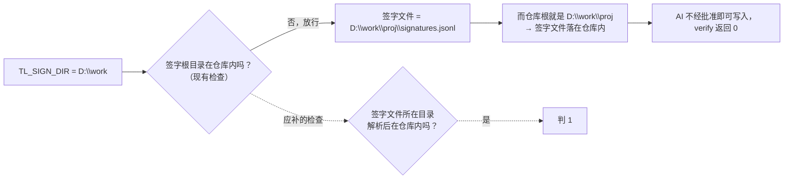

正在复审：已读完规格第 10 节、上一轮报告、交接卡和新版 `tl.py`（370 行），接下来在临时目录跑 218 个用例并逐条实测。

Now running empirical probes in the scratchpad (a copy of the branch; nothing in the repo is touched).

还在复审：权限边界、并发、状态显示都已实测完，最后核对两处规格细节，然后出报告。

# 段1 实现复审报告（第 2 轮，只读）

**审查对象**：`origin/codex/update-implementation-for-segment-1-review`，提交 `c7eb181`，对比基准 `origin/main`（`f3af704`）。

**改动范围**：只新增了两个文件。

| 文件 | 改动 |
| :-- | :-- |
| `src/bin/tl.py` | 新增，370 行 |
| `docs/bootstrap/04_交接卡_段1实现.md` | 新增，44 行 |

上一版 `tl.py` 没有合入 main，所以这次对 main 来说是"新增"，不是"修改"。

**审查方式**：先用 `git archive` 把分支导出到临时目录，所有实测都在那里做，一共写了 6 组探测脚本。审查过程中我为了读规格，曾把本地工作区临时切到 `origin/main`，读完已切回原分支 `claude/loving-fermat-kg7hp5`，工作区是干净的，没有提交、推送或修改任何文件。

---

## 一、结论：有条件通过

上一轮的 2 条阻断、3 条设计风险，主体都已消除。规格第 10 节的 R1～R8 大部分落实，218 个锁定用例全部通过。

这次新发现 **1 条阻断**：R4 的签字目录边界检查可以绕过，而且复现出的正是上一轮非阻断第 4 条的原问题。这条不影响真实签字目录 `C:\TianlongSign` 的签字流程，所以**不妨碍本机首次运行**，但合并进 main 之前必须修掉。

---

## 二、阻断问题

### 阻断1：`TL_SIGN_DIR` 设成仓库的上一级目录，签字记录照样写进仓库

| 项 | 内容 |
| :-- | :-- |
| 位置 | `src/bin/tl.py:55-64`（`sign_file`） |
| 问题 | 代码只检查"签字根目录本身不在仓库内"，没有检查最终的签字文件在哪里。签字文件路径是"签字根目录/仓库名/signatures.jsonl"，如果签字根目录正好是仓库的上一级，"签字根目录/仓库名"就是仓库本身，签字文件于是落在仓库根下。 |
| 实测 | 设 `TL_SIGN_DIR=<仓库上一级>`，`tl sign` 返回 0，仓库根下出现 `signatures.jsonl`。再用同样的变量跑 `tl verify`，返回 0。也就是说，AI 在沙箱里不用弹批准框就能"签字"并自己通过核对，这与上一轮非阻断第 4 条的实测结果完全一样。 |
| 影响 | 字面上满足 R4 的写法（"签字根目录解析后不在仓库内"），但没有达到 R4 的本意。真实签字目录的流程不受影响；段2 的钩子会清掉所有 `TL_` 开头的变量，才是最后一道防线。 |
| 建议 | 算出签字文件路径后，检查它所在目录解析后的真实位置不在仓库根之内，否则判 1。改动约 3 行。现有测试的签字目录与测试仓库是并列关系，不是上下级，改了不影响它们。另请测试员按流程补一个回归用例："`TL_SIGN_DIR` 等于仓库上一级 → 1"。 |

---

## 三、非阻断问题

| # | 位置 | 问题（有实测的注明） | 建议 |
| :-: | :-- | :-- | :-- |
| 1 | `tl.py:247-248` | 按任务核对时，"清单缺失"会直接返回 3，不再看其他包，严重程度排序失效。实测：g1-01 有重复签字（应判 5），同时 g1-02 已签但清单被删，整体返回 **3**；按 R2 的顺序 5 ＞ 3 ＞ 2 ＞ 4，应该返回 5。 | 把"清单缺失"当作一个结果并入逐包结果，最后统一按顺序取最严重的码。 |
| 2 | `tl.py:128-129` | "不许指向 `packages/` 目录"这一条，是在**没解析过的路径字符串**上逐段比较，而且区分大小写。实测：在仓库里建一个链接指向 packages 目录，清单通过这个链接引用另一个包的清单，sign 返回 **0**。Windows 上路径写成 `Packages`，或者末尾带点（`packages.`），也能绕过，这一条是推断、未实测。好在目标文件仍在仓库内，不越过信任边界。 | 改为用解析后的真实路径判断，Windows 下用不区分大小写的方式比较（`os.path.normcase`）。 |
| 3 | `tl.py:156-157` | 签字记录只检查了"字段有没有"，不检查取值： • `package_id` 写成数字时，`verify --task` 程序崩溃，返回 1（应判 5）； • `decision` 写成"随便"，status 显示为"退回"； • `signer` 不是 `APR:Fred`、`signed_at` 不是合法时间、签字记录里的 8 位指纹码与完整指纹不一致，verify 都返回 **0**。 这些都需要先能写签字目录才能构造，实际影响低。 | 逐字段校验类型和取值：`decision` 只能是两种之一，`signer` 固定为 `APR:Fred`，8 位指纹码必须等于完整指纹的前 8 位，不合格判 5。 |
| 4 | `tl.py:309` | 签字记录损坏（比如末行只写了一半）时，`status` 直接返回 5，什么都不显示，Fred 看不到任何进度。规格 5.1 规定 status 只返回 0 或 2。 | status 继续列出进度，只在各包状态上标"签字记录损坏"。 |
| 5 | `tl.py:333-344` | 不带 `--task` 的 status 把每个任务的完整明细都打印出来，也没有规格 5.1 要求的"有几个待签包未签"。 | 恢复"每个任务一行"的汇总格式。 |
| 6 | `tl.py:315`、`358` | status 因为清单不合格返回 2 时，标准错误里只有一句笼统的"状态核对未通过"，看不出是哪个包、什么原因。 | 把各包的具体错误带出来。 |
| 7 | `tl.py:267`、`277` | 假设日志或交接卡不是合法 UTF-8 时，走的是兜底异常处理，返回 1。按规格第 2 节，这属于"记录本身有误"，应判 2。另外，`assumptions.jsonl` 带 BOM 时，没有专门的 BOM 提示。 | 逐文件捕获解码错误并判 2。 |
| 8 | `tl.py:194` | 锁文件残留时（比如签字进程被强行结束），sign 等 10 秒后返回 1，这一点符合 R8。但提示只说"等待签字锁超时"，没说锁文件在哪、该怎么处理。 | 提示里给出锁文件路径，说明"确认没有别的签字进程在运行后，可以删除它"。 |
| 9 | `tl.py:192` | Windows 上，一个文件处于"正在删除"状态时，独占创建会报"拒绝访问"，而不是"文件已存在"。这种情况会走兜底异常，直接返回 1，而不是继续等锁。**未实测**。 | 等锁时把"拒绝访问"也当作"锁被占用"处理，继续重试。 |
| 10 | `tl.py:150` | 签字文件读不出来（比如被别的程序独占打开）时判 5，也就是"记录损坏"，与 R8 规定的"文件被占用判 1"不一致。写不进去时判 1，这部分是对的。**需 Windows 实测**。 | 读取时遇到权限类错误，判 1 并给出"文件被占用"的提示。 |
| 11 | `tl.py:130-132` | 这段"链接不得越出仓库"的检查，与第 126-127 行的判断条件完全相同，是无效代码，注释会让人误以为这里另做了链接检查。 | 删掉，或者改成真正的逐级链接检查（与第 2 条一起改）。 |
| 12 | `tl.py:50` | `TL_NOW` 的解析结果随 Python 版本变化：以 `Z` 结尾的时间，3.10 判 1，3.11 判 0。 | 统一写法，或者在规格里写明只接受 `+08:00` 这种带数字时差的格式。 |
| 13 | 全文 | 代码写得非常紧凑，大量一行多句；`status_state` 里还靠 `locals()` 取变量（第 300 行），不好读、不好维护。 | 以后重构时展开，不急。 |

---

## 四、第 1～5 项逐项结论

### 第 1 项　上一轮 2 条阻断、3 条设计风险：已消除 4 条，1 条还有漏洞

| 条目 | 结论 | 代码位置 | 验证方法和结果 |
| :-- | :-: | :-- | :-- |
| 阻断1（冒名的 git 程序） | ✔ 已消除 | `tl.py:31-35` 从当前目录逐级向上找 `.git`；全文没有调用任何外部程序 | ① 全文检索 subprocess、os.system、popen 等调用外部程序的写法，一处都没有。 ② 在仓库根放一个会写标记文件的假 `git`，把当前目录加到 PATH 最前，同时设 `GIT_DIR`、`GIT_WORK_TREE`：pack、sign、verify 都返回 0，**标记文件没有生成**，仓库根判定正确。 ③ `.git` 是文件（而不是目录）时正常；在子目录里运行正常；当前目录不在任何仓库内时判 1。 |
| 阻断2（手写清单） | ✔ 已消除（有残留，见非阻断第 2 条） | `tl.py:109-133`，由 sign、verify、status、check 调用，都在读受审文件之前 | 手写 11 种不合格清单：`../` 越出仓库、以 `/` 开头、`//主机`、`\\主机`、`C:/`、`C:x`、指向 packages、任务编号不一致、files 为空、两个正文、没有正文。**sign、verify、`verify --task`、status、check 全部返回 2**，签字文件一次都没有生成。另外：用链接指向仓库外 → 2；把 g1-01 的清单复制成 g1-02 → 2。 |
| 设计1（8 位指纹码太短） | ✔ 已消除 | `tl.py:216` 签字记录写入完整指纹；`tl.py:236` verify 比对完整指纹 | 签字后改文件、重写清单并重新封好指纹 → 3；签字记录里有 `manifest_sha256` 字段；"前 8 位相同、完整指纹不同"的情形已有锁定用例覆盖，并且通过。 |
| 设计2（`TL_SIGN_DIR` 绕开批准框） | ⚠ 部分消除 | `tl.py:55-64` | 空串、相对路径、落在仓库内三种情形都判 1，已实测。但设成仓库上一级仍能绕过，见**阻断1**。根本解决靠段2 钩子清掉 `TL_` 开头的变量，这条已写进 R4。 |
| 设计3（空任务直接通过） | ✔ 已消除（有排序缺陷，见非阻断第 1 条） | `tl.py:247-249` | 空任务 → 4；已退回包的清单被删 → 3；任务不存在或编号是 `../x` → 1。 |

### 第 2 项　R1～R8 落实情况，以及有无新的越界风险

| 裁定 | 结论 | 说明 |
| :-- | :-: | :-- |
| R1 仓库根 | ✔ | 见上表"阻断1"一行 |
| R2 清单结构校验 | ✔（残留） | 校验项齐全；严重程度按 5 ＞ 3 ＞ 2 ＞ 4 排（`tl.py:256`）。缺陷见非阻断第 1、2 条 |
| R3 完整清单指纹 | ✔ | 签字记录缺 `manifest_sha256`，或者它不是 64 位十六进制，都判 5（`tl.py:157`） |
| R4 测试开关边界 | ✘ | `TL_NOW` 的检查合格；`TL_SIGN_DIR` 的检查有漏洞，见阻断1 |
| R5 按任务核对 | ✔（残留） | 见非阻断第 1 条 |
| R6 步骤代号格式 | ✔ | `tl.py:91` |
| R7 status 新状态和显示 | ✔ | 实测一个任务里同时出现：需重新打包、签后文件已变、退回、清单不合格、未签，全部显示正确；进度卡各栏齐全（条件步骤的代号取自 `code` 字段，与段1 设计 v0.6 一致）；非法任务编号判 1 |
| R8 其他修正 | ✔（小缺口） | 分项见下表 |

R8 各分项的实测结果：

| 分项 | 实测结果 |
| :-- | :-- |
| 出错提示 | 各类出错情形下标准错误都不为空；加 `--json` 时输出 `{"ok":false,"code":…}` |
| 打包防覆盖 | 12 个 pack 同时运行，得到 12 个不同编号、12 个文件，没有互相覆盖 |
| 签字加锁、落盘 | 3 轮 × 12 个签字同时运行，每轮 12 行、链条完好、没有残留锁文件；同一个包 8 次同时签，恰好 1 次返回 0、7 次返回 5；锁文件残留时约 10.1 秒后返回 1 |
| 假设日志 | `low_reason` 写成数组 → 2 |
| 确认不带理由 | 确认时带理由（包括空串）→ 1 |
| pack 的检查顺序 | 文件不存在同时进度卡不合法 → 1 |
| BOM | 进度卡带 BOM → 2，提示文字正确 |
| 签字文件被占用 | 写入失败 → 1；读取失败的情形见非阻断第 10 条 |

**越界风险检查**：

| 检查项 | 结论 |
| :-- | :-- |
| 越权写入 | 全文只有 5 处写操作：pack 建 packages 目录、pack 写清单（独占创建）、sign 建锁文件、sign 追加签字、sign 删锁文件。写入位置由任务编号（格式已校验）和签字路径决定。唯一的新越界就是阻断1 |
| 外部程序调用 | 没有 |
| 网络访问 | 没有网络相关的库；清单路径中的 `\\` 开头、`//` 开头、盘符写法都在解析路径之前就被挡住了。**残留风险低**：Windows 上如果仓库里有一个指向网络共享的符号链接，解析路径时可能去访问那台主机；在沙箱里建符号链接需要特权，目录联接又不能指向网络路径，所以不容易构造 |
| 路径穿越 | 包编号、任务编号都有严格格式；清单路径已校验，只有指向 packages 这一条还有残留（非阻断第 2 条） |

### 第 3 项　上一轮非阻断各条

| # | 结论 | # | 结论 |
| :-: | :-- | :-: | :-- |
| 1 出错无提示 | ✔（status 的提示太笼统，非阻断第 6 条） | 7 确认带理由 | ✔ |
| 2 pack 覆盖 | ✔ | 8 pack 检查顺序 | ✔ |
| 3 status 不核对编号 | ✔ | 9 BOM | ✔（假设日志文件未覆盖，非阻断第 7 条） |
| 4 `TL_SIGN_DIR` 边界 | ✘ 仍能绕过（阻断1） | 10 status 显示栏目 | ✔ |
| 5 加锁、落盘 | ✔ | 12 文件被占用 | ⚠ 写入部分 ✔，读取部分判 5（非阻断第 10 条） |
| 6 `low_reason` 类型 | ✔ | 11 | 按裁定暂缓：verify 不加 `--json` 时仍输出缩进格式的 JSON，符合暂缓安排 |

### 第 4 项　开发员的假设 V3～V16

| 假设 | 评价 |
| :-- | :-- |
| V3 单包核对顺序 | 合理。签字链检查不读受审文件，排在结构校验之前，与 R2"读受审文件之前先做结构校验"不冲突 |
| V4 非 Windows 系统上，默认签字目录判 1 | 合理，而且安全 |
| V5 `TL_NOW` 为空串时按未设置处理 | 属于规格外的扩展（R4 只规定了 `TL_SIGN_DIR` 为空串的处理），与 `TL_SIGN_DIR` 的处理方式对称，可以接受，**建议架构师追认** |
| V6 确认时带空串理由也判 1 | 从严处理，合理 |
| V7、V8、V11、V13、V14、V16 | 合理，与 R5、R7、R3、R2 的字面一致 |
| V9 只找 `.git`，不读 git 的环境变量 | 与 R1 一致 |
| V10 在子目录运行 pack 时，按当前目录解析相对路径 | 合理 |
| V12 签字文件打不开时判 1 | **与实现不完全一致**：写入失败判 1，读取失败判 5（非阻断第 10 条） |
| V15 先整体校验签字记录，再判重复签字 | 合理。sign 在第 2 步用了一个宽松的重复签字预检，保证了规格 5.3 规定的执行顺序 |

**与规格的冲突**：规格 5.4 写着"签字里的指纹码与清单一致（否则 4）"，实现没有做这项核对。R3 规定 8 位指纹码"只供人看"，可以理解为第 10 节已经取代了这一条，但建议架构师明确一句。我的建议是改为"签字记录内部的 8 位指纹码与完整指纹不一致 → 5"，见非阻断第 3 条。

### 第 5 项　测试和改动范围

| 项 | 结果 |
| :-- | :-- |
| `python -m unittest discover -s tests/acceptance/seg1` | **218 个用例全部通过**，0 失败、0 错误，耗时 49.4 秒。环境是 Python 3.11.15、Linux；Windows 没有跑 |
| tests/、docs/spec/、src/templates/ 有没有被改 | **没有**。对这三个目录做 `git diff --stat origin/main...分支`，输出为空 |
| 补充说明 | 锁定用例的测试签字目录与测试仓库是并列关系，所以测不到阻断1 这种上下级情形。测试员需要按流程补回归用例 |

---

## 五、能否允许本机首次运行

**意见：允许**，但要满足以下条件：

1. **运行环境里不设任何 `TL_` 开头的变量**。实测前在 PowerShell 里运行 `Get-ChildItem Env:TL_*`，结果应为空；Codex 的配置里也不能注入这类变量。满足这一条，阻断1 就不会影响真实签字目录 `C:\TianlongSign`。
2. 人工实测时加做 4 项 Windows 专项核对：
   - **不设** `PYTHONUTF8` 时，中文输出不乱码；
   - 用 Excel 打开签字文件后，运行 sign 和 verify，看退出码和提示（对应非阻断第 9、10 条）；
   - 残留锁文件时，提示是否看得懂；
   - Python 版本不低于 3.10。
3. **合并进 main 之前**：开发员必须修复阻断1，建议顺手修非阻断第 1、3、4 条；测试员补对应的回归用例；然后我再做一次针对性复核（只看改动部分即可）。

阻断1 的修改只涉及 `sign_file` 一个函数。首次实测主要验证的是批准框、文件锁、编码这些 Windows 本机行为，与这个修改基本无关。所以修复可以与首次实测并行，修完后只需重跑与签字目录相关的那一项实测。