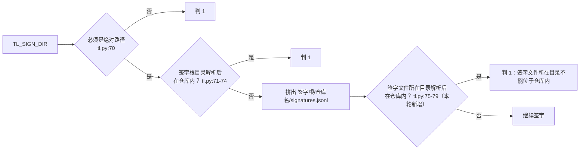

已读完规格第11节、历史报告、交接卡v3及新版`tl.py`（447行）和本轮差异，接下来在临时目录用两个Python版本跑237个用例逐条实测。

237 个用例在 3.10 与默认 3.11 下都已跑完（均 235 通过、2 跳过）；现在写探测脚本，在临时目录实测阻断项和第 11 节各条。

探测脚本自身有个疏漏（pack 没带上环境变量），修正后重跑时间写法的对比。

实测发现一处版本差异：`TL_NOW` 带 1 位、7 位等小数秒时，3.10 判 1、3.11 以上判 0。接着确认它是否也会让签字记录的核对结果随版本变化。

正在用非 root 账户（nobody）运行被跳过的"签字文件读不了"用例，以便在 Linux 上实际验证 11.8。

# 段1 实现复审报告（第 3 轮，REV-段1复核3，只读）

**审查对象**：`origin/codex/update-src/bin/tl.py-for-compliance`，最新提交 `f7f4dc8`。对比基准是 `origin/main`（`dd130c1`），两者的分叉点就是 `dd130c1`。

| 提交 | 内容 |
| :-- | :-- |
| `fae65da` | 起点：最新 main 加上一版 `tl.py`。我逐字比对过，这里的 `tl.py` 与上轮复审的 `c7eb181` 完全相同 |
| `f7f4dc8` | 本轮修改：`tl.py` 增 135 行、删 36 行；交接卡升到 v3 |

相对 main 的全部改动只有两个文件：`src/bin/tl.py`（新增，447 行）和 `docs/bootstrap/04_交接卡_段1实现.md`（新增，59 行）。

**审查方式**：用 `git archive` 把分支导出到临时目录，所有实测都在那里做。一共写了 6 组探测脚本，外加一轮以非 root 账户跑的全量用例。本地工作区始终是干净的，没有提交、推送或修改任何文件，临时文件都已清理。

---

## 一、结论：有条件通过

- 第 2 轮的阻断问题（签字文件可以落进仓库）**已经消除**，5 种变形写法全部判 1。
- 第 11 节 9 条里，8 条完全落实。只有 **11.9 的一部分没有做到**：时间里带小数秒时，3.10 和 3.11 以上版本结果不同，已实测复现。
- 没有新的越权写入、外部程序调用或网络访问。发现 1 处路径判断遗漏，不越出仓库。
- 237 个用例在两个 Python 版本下都通过。`tests/`、`docs/spec/`、`src/templates/` 三个目录都没有改动。

**本轮没有阻断问题**。

---

## 二、重点①：上轮阻断问题是否消除

**代码位置**：`src/bin/tl.py:75-79`（`sign_file` 函数）。先算出签字文件路径，再把它所在的目录解析成真实位置，确认不在仓库根之内，否则判 1。原来第 70-74 行对签字根目录本身的检查保留不变，两道检查同时生效，符合 11.1 的要求。

sign、verify、status 三个命令都经过这个函数（第 269、296、313、379 行）。

**实测**：临时目录里建仓库 `proj`，先 pack 一个包，再用下列 `TL_SIGN_DIR` 分别运行 sign、verify、status：

| 情形 | sign | verify | status | 仓库内出现签字或锁文件？ |
| :-- | :-: | :-: | :-: | :-: |
| a. 仓库的上一级（上轮复现方式） | 1 | 1 | 1 | 否 |
| a2. 绕路写法 `proj/..` | 1 | 1 | 1 | 否 |
| a3. 上一级、末尾带斜杠 | 1 | 1 | 1 | 否 |
| b. 仓库外的链接，指向仓库上一级 | 1 | 1 | 1 | 否 |
| c. `签字根/proj` 是指向仓库内子目录的链接 | 1 | 1 | 1 | 否 |
| d. `签字根/proj` 是指向仓库内的悬空链接（目标还不存在） | 1 | 1 | 1 | 否 |
| f. 仓库本身，或仓库内子目录 | 1 | 1 | 1 | 否 |
| j. 正常情形：与仓库并列的目录 | 0 | 0 | 0 | 否 |

另外，锁定用例中 11.12 第 1 条（"`TL_SIGN_DIR` 为仓库上一级时 sign 判 1"）在两个 Python 版本下都通过。

**结论**：阻断问题已消除。修改方式与上轮建议一致，改了 5 行。

---

## 三、重点②：第 11 节逐条落实情况

| 条款 | 结论 | 代码位置 | 实测或验证依据 |
| :-- | :-: | :-- | :-- |
| 11.1 签字文件位置 | ✔ | 70-79 | 见第二节，8 种情形 |
| 11.2 按任务核对的汇总 | ✔ | 315-326 | 缺失清单的包并入逐包结果；空任务判断改为"既没有清单也没有缺失" |
| 11.3 packages 路径判断 | ✔（有残留） | 141-147 | 链接指向 `packages/`、链接指向 `.tianlong` 都判 2；无效的链接检查代码已删除。残留见非阻断 N2、N3 |
| 11.4 签字记录逐字段校验 | ✔ | 162-184、198 | 表中 7 项全部校验；旧规定"指纹码不一致判 4"已不再使用 |
| 11.5 status 的行为 | ✔（显示有缺口） | 203-225、363-374、403-435 | 只返回 0、1、2；签字记录损坏时返回 0；汇总模式每个任务一行，带待签包数。缺口见 N4、N5 |
| 11.6 编码 | ✔（有小缺口） | 48-54、336、346 | 假设日志、交接卡不是合法 UTF-8 判 2；假设日志带 BOM 判 2。缺口见 N6 |
| 11.7 签字锁 | ✔ | 254-263 | 残留锁约 10.1 秒后判 1，提示含锁文件完整路径和处理办法，没有误删别人的锁。Windows 上"拒绝访问"按锁被占用处理（本机无法实测） |
| 11.8 签字文件被占用 | ✔ | 186-192、207-210、286-288 | 以 root 运行时该用例被跳过；我改用非 root 账户 nobody 跑，3.10、3.11 都通过（读不了判 1，sign 不写入） |
| 11.9 `TL_NOW` 的写法 | ⚠ 部分落实 | 24、61、165 | `Z` 结尾与 `+00:00` 结果一致；**带小数秒时各版本结果不同**，见 N1 |

### 越界风险检查

| 检查项 | 结论 |
| :-- | :-- |
| 越权写入 | 写操作仍然只有原来那几处：pack 建目录（241）、pack 独占写清单（249）、sign 建子目录（271）、建锁（257）、追加签字（287）、删锁（291）。**本轮没有新增写入点** |
| 外部程序调用 | 没有：全文不引用 subprocess、os.system、popen、ctypes |
| 网络访问 | 没有网络相关的库。有一个上轮就存在的残留：Windows 上 `TL_SIGN_DIR` 如果写成 `\\主机\共享`，解析路径时会访问该主机。它属于测试开关，本轮没有变化，见 N8 |
| 路径穿越 | 包编号、任务编号都有严格格式。清单路径仍会检查越出仓库、`..`、盘符。新发现 1 处 packages 判断的遗漏（N2），但目标文件仍在仓库内，不越出信任边界 |

---

## 四、非阻断问题

| # | 位置 | 问题（有实测的注明） | 建议 |
| :-: | :-- | :-- | :-- |
| **N1** | `tl.py:24`、`61`、`165` | **11.9 没有完全落实**。正则允许任意位数的小数秒（`\.\d+`），真正的解析仍交给 Python 自带的时间解析函数，而 3.10 的这个函数只接受 3 位或 6 位小数。 **实测一**：`TL_NOW=…05.1+08:00` 或 `…05.1234567+08:00` 时，pack 在 3.10 判 **1**，在 3.11、3.13 判 **0**。 **实测二**：用 3.11 签出一行 `signed_at` 带 1 位小数的签字记录，同一个签字文件，verify 在 3.10 判 **5**（记录损坏），status 标"签字记录损坏"；在 3.11、3.13 判 **0**。 影响：只在测试开关 `TL_NOW` 带小数秒时出现。正常签字的时间只精确到秒，不受影响 | 按 11.9"须自行解析"的要求，用正则取出年月日、时分秒、时差，再自己组装成时间。最省事的改法是不允许小数秒，或只允许 3 位、6 位小数。顺手把 `\d` 改成 `[0-9]`（`\d` 在 Python 里也匹配全角数字；目前各版本都会拒绝全角数字，结果一致，但写法不严谨）。改动约 2～5 行 |
| N2 | `tl.py:141-147` | packages 判断**有遗漏**。现在的判断方法是：看解析后的路径里有没有名为 `.tianlong` 和 `packages` 的两段。 **实测**：把 `.tianlong` 整体移到仓库内的 `data/tl`，再用链接指回原处。清单里写 `.tianlong/work/qf-001/packages/qf-001-g1-01.json`（引用另一个包的清单），sign 返回 **0**，verify 返回 **0**。 影响：目标仍在仓库内，不越出信任边界；而且需要先把 `.tianlong` 改成链接才能构造 | 改为与"解析后的 `.tianlong/work` 真实位置"比较：目标位于 `<解析后的 work>/<任意任务>/packages/` 之下即判 2 |
| N3 | `tl.py:147`、`238` | packages 判断同时**过严**。只要路径里既有 `.tianlong` 又有 `packages`，不管位置和先后顺序都会拦下。 **实测**：`.tianlong/pkg/src/packages/readme.md` 这种不是任务 packages 目录的文件判 2。规程包装入项目后正好位于 `.tianlong/pkg/`。目前模板仓库里没有名为 packages 的目录，所以暂时没有实际影响 | 与 N2 一起改成按位置精确判断 |
| N4 | `tl.py:409-412`、`211-224` | 签字记录末行只写了一半时： ① 不带 `--task` 的汇总行**完全看不出签字记录已损坏**； ② 写了一半的那个包（实测是 g1-02）显示"未签"，并计入待签包数。 这符合 W2 的字面意思，但 Fred 用汇总模式时发现不了损坏。安全上没有问题：再去签 g1-02 时，链条校验会判 5，不会写入 | 链条损坏时，在输出开头加一行全局提示"签字记录损坏"；汇总行加上损坏包的数量 |
| N5 | `tl.py:434`、`382` | status 因进度卡不合格返回 2 时，标准错误只写"进度卡缺少字段 channel"，**没有写是哪个任务**。有多个任务时无从判断。实测确认 | 错误前面加上任务编号，与包级错误的写法一致 |
| N6 | `tl.py:336`、`346` | check 遇到假设日志或交接卡的编码错误时，**直接中断**，前面已经收集到的问题都丢了。实测：进度卡通道取值不合法、交接卡栏目为空、假设日志不是 UTF-8，三个问题同时存在时，标准错误只显示编码这一条。退出码 2 是对的，但不符合 5.5"逐条列出" | 编码错误也记入问题列表后继续检查 |
| N7 | `tl.py:75-80` | 规格 11.1 只要求检查签字文件**所在目录**。如果 `signatures.jsonl` 本身是指向仓库内的链接，sign 返回 0，内容写进了仓库（实测）。但要构造这种情形，必须先有签字目录的写权限，所以不构成新的越权 | 加固项：签字文件本身解析后也不得在仓库内（或者用不跟随链接的方式打开）。建议架构师决定是否写进规格 |
| N8 | `tl.py:33-37`、`66-80` | 两处与段2 相关的边界，属于告知： ① 在仓库里建一个带 `.git` 的子目录，再从这里运行 tl，这个子目录就成了"仓库根"。实测签字文件可以写进外层仓库（`real/fake/signatures.jsonl`），但签的是内层"假仓库"的包，外层仓库的核对不受影响； ② Windows 上 `TL_SIGN_DIR` 写成本机的共享路径（例如 `\\localhost\D$\…`），解析后的路径形式与盘符形式不同，理论上能绕过 11.1 的比较。需要管理员共享，本机无法实测 | ① 写进段2 规格：钩子要固定运行目录，并核对仓库根就是预期的项目根；② 以后可以改成逐级比较是否为"同一个文件"，比字符串比较更可靠。两项都不急 |

上轮暂缓的第 13 条（代码紧凑、`status_state` 依赖 `locals()`，第 370 行）仍然存在，按 11.11 继续暂缓。

---

## 五、重点③：开发员假设 W1～W8

| 假设 | 评价 |
| :-- | :-- |
| W1：只在 Windows 上不区分大小写 | 合理，与 11.3 的字面一致。Linux 上 `Packages/` 与 `packages/` 本来就是两个目录 |
| W2：链条断开时，能认出包编号的签字都标"损坏" | 从安全角度看合理，损坏的记录不会被当成有效签字。但显示有盲区，见 N4 |
| W3：待签包数只算"未签"的包 | 合理，符合 5.1 的原意 |
| W4：先把 `Z` 换成 `+00:00` 再解析 | **不够**。`Z` 的问题解决了，但小数秒仍依赖不同版本 Python 的解析差异，见 N1 |
| W5：status 读签字文件遇到权限错误判 1 | 合理，符合"只返回 0、1、2" |
| W6：Windows 建锁遇"拒绝访问"按锁被占用处理 | 符合 11.7。副作用：签字目录真的没有写权限时，也会等 10 秒后才报"等锁超时"。建议提示里加一句"也可能是没有写权限" |
| W7：sign、verify、status 都做两道边界检查 | 合理，实测三个命令一致 |
| W8：读签字文件遇到权限错误一律判 1 | 合理，以非 root 账户实测通过。Excel 独占打开的真实情形仍要在 Windows 实测③中核对 |

---

## 六、重点④：测试结果与改动范围

| 运行方式 | 结果 |
| :-- | :-- |
| Python **3.10.20**，root 账户 | 237 个用例：235 通过、2 跳过、0 失败、0 出错，耗时 85.4 秒 |
| **默认 Python（本容器为 3.11.15）**，root 账户 | 237 个用例：235 通过、2 跳过、0 失败、0 出错，耗时 86.6 秒 |
| 两个跳过的用例 | ① Windows 专用的 `Packages/` 大小写用例，Linux 上按设计跳过；② 11.8 签字文件读不了，因为 root 仍能读取该文件 |
| 补充：非 root 账户（nobody），3.11 | 237 个用例：236 通过、1 跳过（只剩 Windows 专用那条）。11.8 用例在 3.10 下也单独跑过，通过 |
| 三个受保护目录有无改动 | 对 `tests`、`docs/spec`、`src/templates` 运行 `git diff --stat origin/main...分支`，**输出为空** |

说明：交接卡写的"默认 Python 3.14.4"是开发员机器上的版本，本容器的默认版本是 3.11.15，两边结果一致。锁定用例没有覆盖 N1（小数秒）的情形，所以用例全部通过并不代表 11.9 已完全落实。

---

## 七、能否允许合并

**意见：允许合并，但先修 N1。**

1. **合并前**：开发员修 N1（11.9 小数秒，约 2～5 行），用 Python 3.10 和默认 Python 各跑一遍 237 个用例，并把结果写进交接卡。这处改动很小，也不涉及签字目录或写入逻辑，修完后**不必再送我复审**，两个版本的测试结果就足以证明。
   - 如果 Fred 要先合并，也可以由架构师在规格中注明"`TL_NOW` 不支持小数秒"，作为已知偏差接受。它只影响测试开关，不影响正常签字。
2. **合并后安排**：N2 与 N3 一起改成按位置精确判断；N4、N5、N6 改进显示与报错；N7、N8 交给架构师决定是否写进段1 或段2 的规格。都可以在下一轮一并处理。
3. **Windows 实测③** 照原计划进行，重点核对三项：Excel 占用签字文件、删除中的锁文件、不设 `PYTHONUTF8` 时的中文输出。运行环境里仍然**不设任何 `TL_` 开头的变量**。